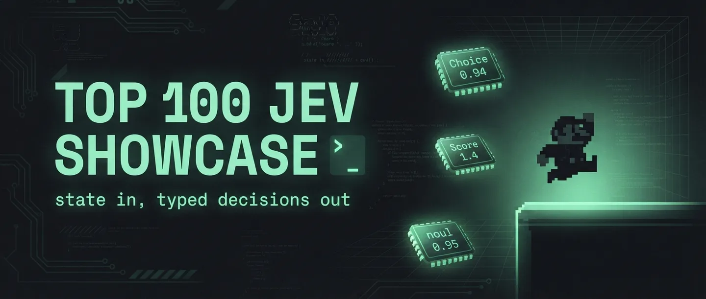
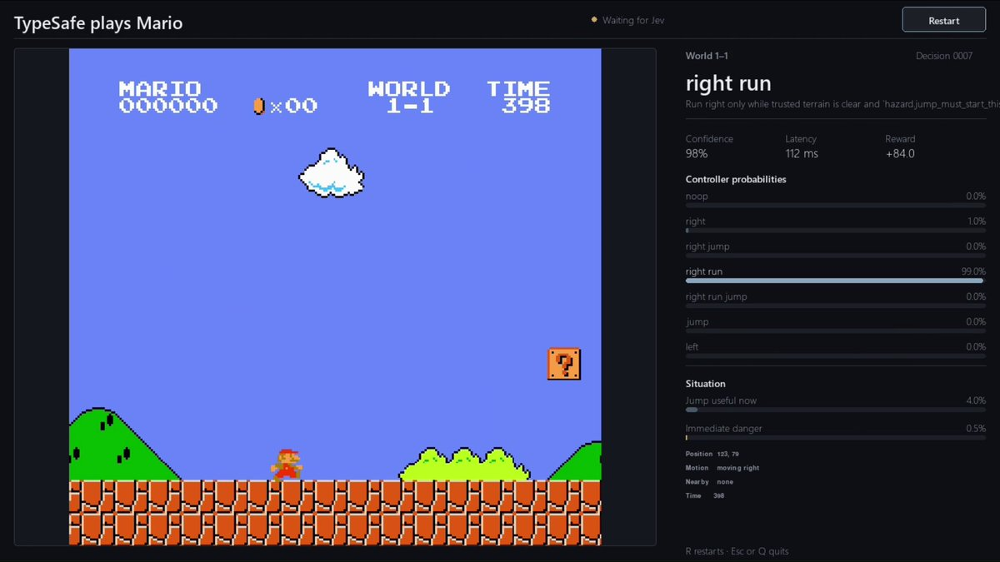

# awesome-jev-prompt



> **The unofficial, community-maintained collection of prompts, states, and decision patterns for [Jev](https://typesafe.ai/) — TypeSafe AI's first System One Model.**
>
> Jev doesn't take "prompts" in the LLM sense. It takes a **state** and returns **typed decisions with calibrated probabilities** — Choice, Score, Noul. This repo collects the patterns that make those decisions good — plus the **Top 30 community builds** (135 tracked), ranked, with preview cards.
>
> *Unofficial. Not affiliated with or endorsed by TypeSafe AI. "Jev" and "System One" are TypeSafe AI product names, used here descriptively.*

[](https://neta.art/app/jev-prompt)
[](#sources)
[](#-top-30-jev-showcase)
[](SOURCES.md)
[](https://docs.typesafe.ai/models)

---

## Why this exists

Jev launched 2026-09-15. Within 72 hours there were 568+ GitHub repos touching it — but the knowledge
is scattered across launch posts, cookbooks, READMEs and X threads. This repo is the organized layer:

- **Primitives & state formats** — the official grammar, verbatim
- **Patterns** — fan-out, confidence-gated routing, composite scoring, intent routing
- **Cookbook index** — all 16 official cookbooks, one decision each
- **Case studies** — the Mario state schema, the Doom loop, Wikiracing
- **Community patterns** — what the first 72 hours built, with links

Companion HTML gallery: **[Top 100 Jev Showcase & Jev Prompts](https://neta.art/app/jev-prompt)** (live on neta.art).

## The 60-second version

```
state (JSON) ──▶ Jev ──▶ { "choice": "right_jump", "p": 0.87, "confidence": 0.93 }
```

1. Build a **state**: a string, a JSON object, or an array. Recommended default: object.
2. Ask **questions**: Choice (pick one of N), Score (number on a scale), Noul (true/false + probability).
3. All questions see the same state, evaluated in parallel, in 70–500ms.
4. Code branches on the answers; act when confident, escalate when not.

```python
state = {
  "ticket":  {"subject": "Duplicate charge", "messages": [...]},
  "order":   {"id": "A-104", "charges": [{"amount_usd": 49, "status": "captured"},
                                          {"amount_usd": 49, "status": "captured"}]},
  "refund_policy": "Duplicate charges are eligible for a refund."
}
# questions: noul("Did the customer request a refund?"),
#            noul("Does the policy support it?"),
#            choice("Which team should handle this?", ["billing","technical","account"])
```

## 🏆 Top 30 Jev Showcase

**204 projects tracked, top 30 ranked by stars** — every card carries its own preview:

| # | Project | ★ | What it does |
|---|---|---|---|
| 1 | [browser-use/jev-ultrafast](https://github.com/browser-use/jev-ultrafast) | 1052 | The browser-use team's ultrafast Jev integration |
| 2 | [vinnylarouge/jevlike](https://github.com/vinnylarouge/jevlike) | 510 | Reverse-engineered Jev: option-attention head + Doom/chess checkpoints |
| 3 | [TheoLeeCJ/openjev](https://github.com/TheoLeeCJ/openjev) | 384 | "Jev on a 3090 at home?" — the open replica |
| 4 | [jarrodwatts/jev-trader](https://github.com/jarrodwatts/jev-trader) | 332 | One AI trade decision every Monad block |
| 5 | [fhshaik/typesafe-mario](https://github.com/fhshaik/typesafe-mario) | 140 | Jev plays Mario from RAM — repo pushed 90s after the tweet |
| 6 | [devagrawal09/jev-review](https://github.com/devagrawal09/jev-review) | 71 | Staged code-review workflow with a local dashboard |
| 7 | [typesafeainate/dspy-typesafeify](https://github.com/typesafeainate/dspy-typesafeify) | 55 | DSPy decorator routing predictions through TypeSafe |
| 8 | [gargpratyush/jev-router](https://github.com/gargpratyush/jev-router) | 41 | Route Claude Code tasks to the cheapest capable model |
| 9 | [NiazMorshed2007/jev-review](https://github.com/NiazMorshed2007/jev-review) | 40 | Local-first MCP plugin for continuous quality review |
| 10 | [RomanSlack/jev-drone](https://github.com/RomanSlack/jev-drone) | 36 | Camera-only autonomous drone, Jev at 2.5Hz |

### ⭐ Worth studying (beyond the star ranking)

| | Project | Why |
|---|---|---|
| 📄 | [jerryjliu/docjev](https://github.com/jerryjliu/docjev) | **LlamaIndex's founder shipped document classification on Jev** — first framework-author endorsement. |
| 💬 | [jev-chat/jev-chat-jarvis](https://github.com/jev-chat/jev-chat-jarvis) | Chat sidekick on real phones: WeChat/QQ/X — now an org, 3,600+★. |
| 🌌 | [phyous/tsai-sc](https://github.com/phyous/tsai-sc) | **Jev beat StarCraft's Strongarm mission** — verified victory screen, attempt 16. |
| 🧩 | [vinnylarouge/jevlike](https://github.com/vinnylarouge/jevlike) | The reverse-engineering: one option-attention head reproducing the Jev shape. |

➡️ **[Full ranked list of all 204 projects](data/community.json)** · interactive version with preview cards: **[Top 100 Jev Showcase](https://neta.art/app/jev-prompt)**

## Repository map

```
awesome-jev-prompt/
├── README.md              ← you are here
├── SOURCES.md             ← 39 sources with verification status & access methods
├── data/
│   ├── sources.json       ← machine-readable source registry
│   ├── prompts.json       ← the 42-entry prompt/state/pattern collection
│   ├── community.json     ← 119 repos + 15 tracked X posts (the showcase dataset)
│   └── raw/
│       └── discord-show-and-tell-2026-09-17.md  ← first-hand 714-link channel scrape
└── site/                  ← the full gallery, self-contained (assets included)
    └── assets/            ← 119 preview cards + hero banner + media stills
```

## What's in the pattern collection

**What the first 72 hours built** — six clusters:

| Cluster | Count | Best-of |
|---|---|---|
| 🤖 Agents & computer use | 45+ | typesafe-computer-use · jev-browser · blink |
| 🛠️ Devtools, SDKs, MCP | 30+ | jev-router · typesafe-mcp · ruby_llm-typesafe |
| 🎮 Games & physics AI | 12 | typesafe-mario · TerraBlind · things-vs-stuff |
| 🛡️ Guardrails & safety | 8 | agent-control-plane (Dafny proofs) · second-thought · winnow |
| 🔬 Replicas & benchmarks | 10 | jevlike · openjev · jev-on-a-laptop |
| 💰 Trading & data | 4 | jev-trader · btc-jev-signal · advocaat |

## The case study: the 90-second repo



[@faadilhshaik](https://x.com/faadilhshaik/status/2100086301894881578) got Jev playing Super Mario Bros.
(2,278 likes), then pushed [fhshaik/typesafe-mario](https://github.com/fhshaik/typesafe-mario) 90 seconds
after posting. The state schema — `player / trajectory / hazard / terrain / reaction_timing /
recent_control / episode` — is reproduced verbatim in [`data/prompts.json`](data/prompts.json).
The model never sees a screenshot.

## Contributing

PRs welcome. Rules:
1. One entry = one decision (state + questions + primitive), not a marketing blurb.
2. Include the source link; mark verbatim vs. reconstructed.
3. Numbers drift — include the date you measured.

## Sources

See **[SOURCES.md](SOURCES.md)** for the full registry: 16 official sources, 12 community sources,
6 media items, all with access method and verification status. Data snapshot: **2026-09-17**.

## License

CC0 for original content. Linked projects and quotations remain the property of their authors.
"Jev", "System One", and "TypeSafe" are trademarks of TypeSafe AI; this project makes descriptive,
nominative use only and claims no affiliation.

---

*Built by the community, for the community. ∵ ⩆*
